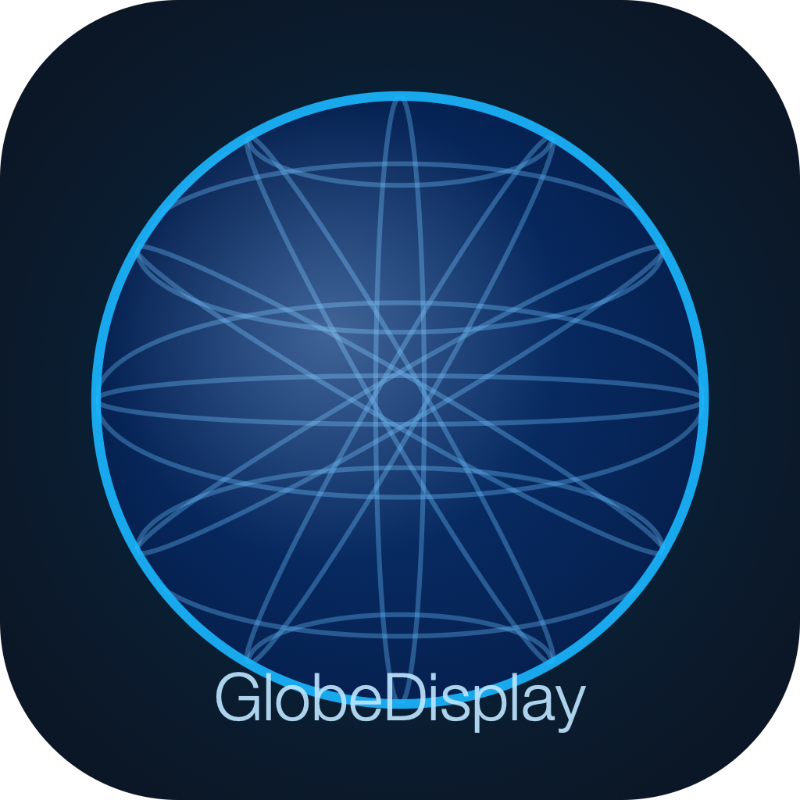

# GlobeDisplay

An open-source iPad application for driving a **Global Imagination MagicPlanet** spherical projection globe via HDMI. GlobeDisplay renders equirectangular-projected imagery to the globe while providing an interactive educational control interface on the iPad's built-in screen.



## Features

- **13 bundled planetary textures** — all eight planets plus Pluto, Earth night lights, topography, and cloud cover
- **Real-time data overlays** — live earthquakes (USGS), volcanoes (Smithsonian GVP), and wildfires (GDACS)
- **Guided educational stories** — narrated multi-step tours of the solar system and Earth's systems
- **NOAA SOS dataset compatible** — import any of 500+ datasets from the NOAA Science on a Sphere catalog
- **Projection calibration** — longitude offset, gamma correction, south-pole radius, brightness, and flip controls
- **Offline mode** — bundled content always available; live feeds degrade gracefully with status indicators

## Hardware Requirements

| Component | Details |
|---|---|
| iPad | Any iPad with iPadOS 17.0+ and a USB-C port |
| Adapter | USB-C Digital AV Adapter |
| Cable | HDMI cable |
| Globe | Global Imagination MagicPlanet (any size with HDMI input) |

See [SETUP_GUIDE.md](Documentation/SETUP_GUIDE.md) for detailed hardware connection instructions.

## Building

1. Clone the repository
2. Open `GlobeDisplay.xcodeproj` in Xcode 16 or later
3. Select your development team in project settings
4. Build and run (Cmd+B / Cmd+R)

Minimum deployment target: **iPadOS 17.0**

## Content

### Bundled Content

The app ships with 13 equirectangular textures at 2048×1024 resolution covering all solar system bodies and key Earth datasets. Source imagery is public domain (NASA/NOAA) or used under CC BY 4.0 with attribution.

### Importing NOAA SOS Datasets

GlobeDisplay supports the NOAA Science on a Sphere dataset format. See [CONTENT_GUIDE.md](Documentation/CONTENT_GUIDE.md) for instructions on importing datasets from the [NOAA SOS Catalog](https://sos.noaa.gov/catalog/datasets/).

## Architecture

```
DataFeedService (USGS · GVP · GDACS)
    → GeoEvent models
    → OverlayCompositor (lat/lon → equirectangular pixels)
    → Metal overlay texture

ContentManager (bundled + imported content)
    → ContentBundle
    → RenderEngine (Metal GPU compositor)
        → ExternalDisplayManager
        → HDMI → MagicPlanet
```

The MagicPlanet uses a **polar azimuthal equidistant** internal projection. GlobeDisplay's Metal shader converts equirectangular source images to the polar format in real time — no preprocessing required.

See [ARCHITECTURE.md](Documentation/ARCHITECTURE.md) for full technical documentation.

## License

MIT — see [LICENSE](LICENSE).

Content attribution for individual textures is displayed in the app's info panel for each dataset.

## Contributing

Contributions are welcome. Please open an issue before submitting a pull request for significant changes. See [CONTRIBUTING.md](CONTRIBUTING.md) for guidelines.
